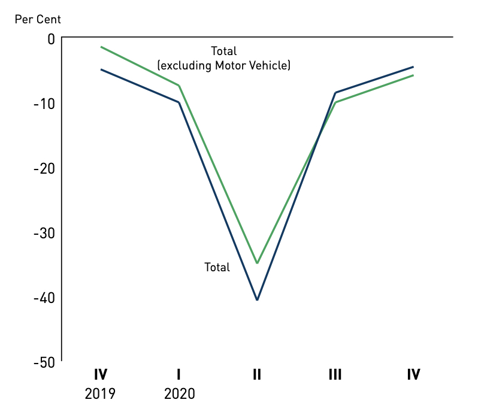
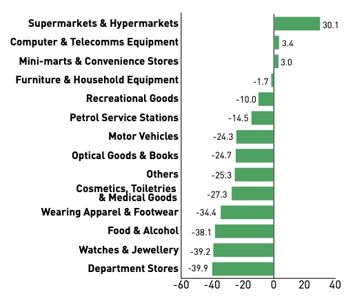
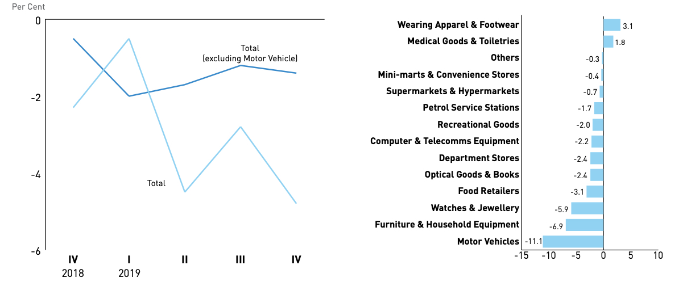

\tableofcontents
<!-- \listoffigures -->
<!-- \listoftables -->
\newpage

```{r, echo=FALSE, include=FALSE}
library(knitr)
library(tinytex)
library(tidyverse)
library(openxlsx)
library(xts)
library(fpp2)
library(seasonal)
library(GGally)
library(gridExtra)
library(urca)
```

# Introduction 

## Dataset

* Name:       Retail Sales Index
* Coverage: 	January, 1985 to January, 2021
* Frequency: 	Monthly
* Source: 		Ministry of Trade and Industry -  Department of Statistics [(Singapore Department of Statistics, 2021)](#one){#oneR}
* Base year: 	2017

## Importance of Retail Sales

Retail Sales is an important part of the economy of any country. It measures the sales of durable and non-durable goods and is used to gauge consumer demand over a certain period of time [(Investopedia, n.d.)](#two){#twoR}. It indicates the health of the economy and whether it's heading towards contraction or expansion in the business cycle and is one of the most important economic indicators. This is also because consumer spending is a big part of the Gross Domestic Product (GDP) of a country.

Retail Sales is measured in the local currency, which, for our case, is Singapore Dollars (S\$). For the month of January '21, the total retail sales value was estimated to be around S\$3.8 billion for Singapore [(ChannelNewsAsia, 2021)](#seven){#sevenR}. 

Although forecasting this value would be of great economic importance, due to several factors such as inflation, this value should not be forecasted directly as it would lead to erroneous results and misleading conclusions. This is why we use the Retail Sales Index (referred to as RSI from now on). 

## What is RSI?

RSI measures the short-term performance of retail industries based on the sales records of retail establishments [(Retail Sales Index, 2020)](#three){#threeR}.

The RSI is presented at both current prices and constant prices. The index at current prices measures the changes of sales values which can result from changes in both price and quantity. By removing the price effect, the index at constant prices measure the changes in the volume of economic activity. We study the index at constant prices, with 2017 as the base year.

## What does RSI include?

RSI comprises of the following types of retailers in Singapore[(SingStat, 2021)](#four){#fourR}:

1. Sell via both physical stores and online/e-commerce sites
2. Sell via physical stores only
3. Sell mainly via online/e-commerce sites

These include the following industries [(Ministry of Trade & Industry [MTI], 2021)](#five){#fiveR}:

* Motor Vehicles
* Computer & Telecomms Equipment
* Food & Alcohol
* Recreational Goods
* Wearing Apparel & Footwear
* Department Stores
* Optical Goods & Books
* Petrol Service Stations
* Supermarkets & Hypermarkets
* Mini-marts & Convenience Stores
* Watches & Jewellery
* Cosmetics, Toiletries & Medical Goods
* Furniture & Household Equipment
* Others

## Recent Industry Trends

```{r intro, echo=FALSE, out.width = '50%'}

```

*Figure 1*. Trend of RSI in 2020 [(MTI, 2021)](#five){#fiveR}.

The Retail Trade sector of Singapore contracted by 4.7 per cent year-on-year in the fourth quarter of 2020, which was an improvement from the 8.6% decline in the previous quarter. For the whole of 2020, the sector shrank by 16%, an extremely poor performance as compared to the 2.4% contraction in 2019, marked by a sharp decline in the second quarter, which coincided with the Circuit Breaker. The primary reason to which this shrink can be attributed to is the outbreak of the global COVID-19 pandemic, which resulted in stricter health measures, including the Circuit Breaker and other border control measures. 

```{r, echo=FALSE, out.width = '50%'}

```

*Figure 2*. Sector-wise trends in RSI in Singapore for 2020 [(MTI, 2021)](#five){#fiveR}.

In terms of motor vehicle sales, the drop was in line with the reduction in COE supply.

However, in terms of non-motor vehicle sales, there was a large decline caused by slowed demand and public health measures. Although there was an increase in sales for Supermarkets & Hypermarkets (+30.1%) due to increased demand caused by the pandemic and lockdown, most of the other sectors took a hit, especially luxury items like watches & jewellery. This was amplified by the fact that Singapore had closed borders to tourists, who used to contribute a lot to the retail sales.

```{r, echo=FALSE, out.width = '100%'}

```

*Figure 3*. Trends for RSI in 2019, overall and sector-wise [(MTI, 2020)](#six){#sixR}.

Studying the trends for 2019 shows that the RSI was already declining before the pandemic hit, amplified by dropping motor vehicle sales caused by a reduction in COE numbers. For non-motor vehicle sales, the drop was caused by a fall in sales volume for both discretionary and non-discretionary goods.

## Outlook for 2021

* There is still uncertainty regarding the trajectory of the global economic recovery. Although the United States and Eurozone are heading towards herd immunity due to their strong vaccine drives, there is still instability in the region [(MTI, 2021)](#five){#fiveR}. There has been a recent surge of COVID infections in India, and it has been leading the world in number of cases [(Fung, 2021)](#eight){#eightR}. The net effect on the external demand for Singapore still seems uncertain. 

* Singapore was faring well domestically in terms of controlling the number of cases and vaccinating its citizens, but a new cluster has recently developed, caused by the highly-contagious Indian variant of the virus [(Teo, 2021)](#nine){#nineR}. This has led to increased restrictions in the country and the possibility of another Circuit Breaker [(Kit, 2021)](#ten){#tenR}. The domestic outlook is uncertain.

* In terms of the RSI, the consumer-facing sector of retail trade is predicted to gain slowly due to an imminent global economic recovery over the course of the year, but the restriction on tourists along with capacity constraints due to the health measures are expected to offset some of this gain. It is not expected to reach pre-COVID levels this year [(MTI, 2021)](#five){#fiveR}.

## Methodology

### Reading the Dataset

The Excel file is loaded, and the data are converted to a timeseries object of monthly frequency, from January 1985 to January 2021.

```{r, echo=FALSE}
RSI <- readxl::read_excel("RSI.xlsx")
RSI <- ts(RSI[,2],start = c(1985,1), end = c(2021,1), frequency = 12)
```

### Training and Testing Models

RSI data are split into a training set (80%) and a test set (20%). The training and test sets will be used to visualize the accuracy of the models. 

```{r, echo=FALSE}
RSI.train <- subset(RSI, end=0.8*length(RSI))
RSI.test <- subset(RSI, start=0.8*length(RSI)+1,end=length(RSI)+1)
```

However, as the test set includes the outlier values caused by the COVID-19 pandemic, using test set accuracy to compare different models will give skewed results. Hence, we use cross-validation root mean square errors (RMSE), calculated using the *tsCV* function, will be used to compare the different models, as this provides a more robust comparison.

At the end, the best models are picked using the cross-validation RMS errors and used for forecasting.

# Exploratory Analysis

## Time Series Plot

```{r exploratory, fig.height=4.5, echo=FALSE}
autoplot(RSI) + ylab("RSI (Based on 2017=100 Index)")  + xlab("Year") + 
  labs(caption = italic("Figure 4.")~"Time series plot of RSI.") + 
  theme(plot.caption = element_text(hjust = 0))
```

* The RSI shows an overall upward trend from 1985-2021.

* Some of the slumps observed can be attributed to the following [(Sng, 2020)](#eleven){#elevenR}:
    + 1985 Recessionary Crisis
    + 1998 Asian Financial Crisis
    + 2001-03 Low Growth and High  Unemployment Crisis (9/11, Bali Bombings, SARS Pandemic)
    + 2008 Global Great Recession
    + 2020 COVID-19 Pandemic
    
* The RSI also shows a seasonal pattern, that remains approximately the same size as the level of the series increases.

* There is no cyclic behaviour observed.

## Seasonal Plot

```{r, fig.height=3.6, echo=FALSE}
ggseasonplot(RSI,year.labels=TRUE) + ylab("RSI (Based on 2017=100 Index)") + 
  labs(caption = italic("Figure 5.")~"Seasonal plot of RSI.") + 
  theme(plot.caption = element_text(hjust = 0))
```

* Most of the years show a similar seasonal pattern: there are increased sales in January and December, which could be attributed to the holiday season (Christmas), as well as a small spike in March which could be attributed to the Chinese New Year. The variation is small for the other months, but similar across the years.

* A sharp fall in April ‘20 marks the beginning of the Circuit Breaker in Singapore, which led to a lot of restrictions and hence a significant drop in the RSI.

## Subseries Plot

```{r, fig.height=3.6, echo=FALSE}
ggsubseriesplot(RSI) + ylab("RSI (Based on 2017=100 Index)") +
  labs(caption = italic("Figure 6.")~"Subseries plot of RSI.") + 
  theme(plot.caption = element_text(hjust = 0))
```

* Months like February with lower number of days have a lower RSI on average, and it fluctuates from April-November based on the number of days each month has.

* All months show an overall increase as the years increase, confirming the upward trend observed in the time series plot.

## ACF Plot

```{r, fig.height=3.5, echo=FALSE}
ggAcf(RSI) + 
  labs(caption = italic("Figure 7.")~"ACF plot of RSI.") + 
  theme(plot.caption = element_text(hjust = 0))
```

* Autocorrelation exists for all lag values.

* The ACF plot shows a slowly decreasing trend, as well as a seasonal pattern of monthly frequency.

## Lag Plot

```{r, fig.height=3.5, echo=FALSE}
gglagplot(RSI) + 
  labs(caption = italic("Figure 8.")~"Lag plot of RSI.") + 
  theme(plot.caption = element_text(hjust = 0))
```

* The lag plots show a bivariate scatter plot for the current and lagged values for each month.

* There exists a strong relationship for all lagged values, with lag 12 having the strongest correlation. This confirms the monthly seasonal pattern we observed above, as well as the ACF plot which showed that the RSI is serially correlated.

# Benchmark Methods

## Unsatisfactory Methods

The benchmark methods tested include Average, Naive, Seasonal Naive, and Random Walk with Drift methods. As these methods do not account for either the seasonality or the trend, their results will not be satisfactory (see Appendix).

## STL-Random Walk with Drift

The STL method is used to decompose the time series into its trend, seasonal and remainder components. The method can be configured to perform multiplicative decomposition, however, as the seasonality of our time series approximately remains constant as the level of the series increases, additive decomposition is sufficient.

```{r benchmark, echo=FALSE, warning=FALSE,fig.height=3.5}
decomp.stl <- stl(RSI.train,s.window="periodic")
autoplot(decomp.stl)+
  labs(caption = italic("Figure 9.")~"RSI after STL decomposition.") + 
  theme(plot.caption = element_text(hjust = 0))
```

The STL-Naive method is unsatisfactory and will not lead to good forecasts as it doesn't account for a trend (see Appendix).

The training set is used to forecast using the STL-Random Walk with Drift method. The time series is decomposed into the three components, and the seasonally adjusted data is forecasted using the random walk with drift method. The forecasted time series is then re-seasonalized by adding the seasonal naive forecasts of the seasonal component.

The forecasted data is visualized along with the test set. The residuals are also checked.

```{r, echo=FALSE,warning=FALSE,fig.height=3.7}
fc.drift.stl <- decomp.stl %>% forecast(method="rwdrift",h=length(RSI.test))
autoplot(RSI.train)+autolayer(fc.drift.stl,series="forecast")+autolayer(RSI.test,series="test set") +
  ylab("RSI (Based on 2017=100 Index)")+
    autolayer(fitted(fc.drift.stl),series="fitted series")+xlab("Year")+
  labs(caption = italic("Figure 10.")~"Forecasts from STL + Random Walk with drift.") + 
  theme(plot.caption = element_text(hjust = 0))
```

```{r, echo=FALSE, warning=FALSE,fig.height=4}
checkresiduals(fc.drift.stl)
```

*Figure 11*. Residuals for forecasts from the STL + RW with Drift method.

* The residuals seem to be white noise as indicated by the time series plot. The model is unbiased.
* The low p-value (<0.05) in the Ljung-Box test allows us to reject the null hypothesis of no autocorrelation. Hence, the model shows serial correlation. This is confirmed by the ACF plot, which has a spike at the first lag. The model is inefficient, and the calculated prediction intervals are large.
* The residuals have constant variance, but are not normally distributed. There will be some difficulty in calculating the prediction intervals.

The tsCV RMS errors are calculated and stored for use in the later sections.

```{r, echo=FALSE}
f.stlRWFD <- function(RSI,h) {
  forecast(stl(RSI,s.window="periodic"),method="rwdrift",h=h)
}
tsCV.stlRWFD <- tsCV(RSI,f.stlRWFD)
tsCV.stlRWFD <- sqrt(mean(tsCV.stlRWFD^2,na.rm=TRUE))
cat("STL + RW with Drift",tsCV.stlRWFD,"\n")
```

# Exponential Smoothing Models

## Unsatisfactory Methods

The ETS models tested include Simple Exponential Smoothing, Holt's linear trend, Holt's damped trend, Holt-Winters damped methods. As these methods do not account for the seasonality, their results will not be satisfactory (see Appendix).

## Holt-Winters Seasonal Method

The Holt-Winters seasonal method has one forecast equation and three smoothing equations, for the level, trend, and seasonal component, respectively. In the additive method, the seasonal component is expressed in absolute terms and in the multiplicative method, in relative terms.

```{r expsmooth, echo=FALSE, fig.height=3.8}
fc.HWadd <- hw(RSI.train,seasonal="additive", h = length(RSI.test))
fc.HWmul <- hw(RSI.train,seasonal="multiplicative", h = length(RSI.test))
autoplot(RSI.train) +
autolayer(fc.HWadd$mean, series="HW additive forecasts") +
  autolayer(fitted(fc.HWadd),series="fitted (additive)")+
  autolayer(fitted(fc.HWmul),series="fitted (multiplicative)")+
autolayer(fc.HWmul$mean, series="HW multiplicative forecasts") +
  autolayer(RSI.test,series='test set') +
xlab("Year") + ylab("RSI (Base: 2017)") +
guides(colour=guide_legend(title="Forecast"))+
  labs(caption = italic("Figure 12.")~"Forecasts from Holt-Winters seasonal methods.") + 
  theme(plot.caption = element_text(hjust = 0))
```

The two models seem to have very similar performance, as the seasonal component of our time series approximately remains the same with an increase in level.

The tsCV RMS errors are calculated and stored for use in the later sections. 

```{r, echo=FALSE}
tsCV.HWadd <- tsCV(RSI,hw,seasonal='additive')
tsCV.HWmul <- tsCV(RSI,hw,seasonal='multiplicative')
tsCV.HWadd <- sqrt(mean(tsCV.HWadd^2,na.rm=TRUE))
tsCV.HWmul <- sqrt(mean(tsCV.HWmul^2,na.rm=TRUE))
cat("Additive",tsCV.HWadd,"\n")
cat("Multiplicative",tsCV.HWmul,"\n")
```

The Holt-Winters multiplicative method has a slightly lower error than the additive method, which could be due to the fact that there is very small variation in the seasonal component over time that this model is able to capture.

We check its residuals.

```{r, echo=FALSE,fig.height=4.2}
checkresiduals(fc.HWmul)
```

*Figure 13*. Residuals for forecasts from the Holt-Winters seasonal methods.

* The residuals seem to have zero mean as indicated by the time series plot. The model is unbiased.
* The low p-value (<0.05) in the Ljung-Box test allows us to reject the null hypothesis of no autocorrelation. Hence, the model shows serial correlation. This is confirmed by the ACF plot, which has a spike at lags 22 and 25. The model is inefficient, and the calculated prediction intervals are large.
* The residuals are not normally distributed, and do not have constant variance. There will be a difficulty in calculating the prediction intervals.

## Optimal ETS

The ETS model considers error, trend and seasonality components, as before. The *ets* function is used to pick the optimal ETS model.

```{r, echo=FALSE,fig.height=3.3}
fc.ETS <- ets(RSI.train)
fc.ETS['method']
fc.ETS <- forecast(fc.ETS,h=length(RSI.test))
autoplot(RSI.train) +
autolayer(fc.ETS, series="ETS forecasts") +
  autolayer(RSI.test,series="test set") +
  autolayer(fitted(fc.ETS),series="fitted")+
xlab("Year") + ylab("RSI (Base: 2017)") +
guides(colour=guide_legend(title="Forecast")) +
  labs(caption = italic("Figure 14.")~"Forecasts from ETS(A,Ad,A).") + 
  theme(plot.caption = element_text(hjust = 0))
```

The optimal ETS model is found to be ETS(A,Ad,A), which means that the error and seasonal components are additive, and the trend is additive damped.

We also check the residuals.

```{r, echo=FALSE,fig.height=3.9}
checkresiduals(fc.ETS)
```

*Figure 15*. Residuals for forecasts from ETS(A,Ad,A).

The residual diagnostics are similar to those of the Holt-Winters multiplicative method: 

* The model is unbiased.
* The model is inefficient as the model shows serial correlation at lags 22 and 25.
* The calculation of prediction intervals is difficult.

The tsCV RMS errors are calculated and stored.

```{r, echo=FALSE}
f.ETS <- function(RSI,h) {
  forecast(ets(RSI),h=h)
}
tsCV.ETS <- tsCV(RSI,f.ETS)
tsCV.ETS <- sqrt(mean(tsCV.ETS^2,na.rm=TRUE))
cat("ETS(A,Ad,A)",tsCV.ETS,"\n")
```

## STL-ETS Method

The training set is used to forecast using the STL-ETS method. 

The time series is decomposed into the three components, and the seasonally adjusted data is forecasted using the optimal ETS model. The forecasted time series is then re-seasonalized by adding the seasonal naive forecasts of the seasonal component.

We plot the RSI series along with the fitted series, as well as the forecasts with their prediction intervals.

```{r, echo=FALSE,fig.height=4}
fc.stlETS <- stlf(RSI.train, h = length(RSI.test), biasadj= TRUE, method = "ets")
autoplot(RSI.train)+autolayer(fc.stlETS,series="forecast")+autolayer(RSI.test,series="test set") +
  autolayer(fitted(fc.stlETS),series="fitted model")+
  ylab("RSI (Based on 2017=100 Index)")+xlab("Year")+
  labs(caption = italic("Figure 16.")~"Forecasts from STL + ETS method.") + 
  theme(plot.caption = element_text(hjust = 0))
```

The model seems to fare slightly better than just the ETS method.

We check the residuals.

```{r, echo=FALSE,warning=FALSE,fig.height=4.2}
checkresiduals(fc.stlETS)
```

*Figure 17*. Residuals for forecasts from STL + ETS method.

The residual diagnostics give similar conclusions as those of the ETS model.

The tsCV RMS error is calculated and stored. 

```{r, echo=FALSE}
tsCV.stlETS <- tsCV(RSI,stlf,biasadj=TRUE,method="ets")
tsCV.stlETS <- sqrt(mean(tsCV.stlETS^2,na.rm=TRUE))
cat("STL + ETS", tsCV.stlETS, "\n")
```

## Comparing Exponential Smoothing Models

The tsCV RMS errors calculated for the different Exponential Smoothing models are compared.

```{r, echo=FALSE}
errorsETS <- rbind(tsCV.HWadd,tsCV.HWmul,
                     tsCV.ETS,tsCV.stlETS)
row.names(errorsETS) <- rbind("Holt-Winters Additive", 
                                "Holt-Winters Multiplicative",
                                "ETS","STL-ETS")
colnames(errorsETS) <- cbind("tsCV RMSE")
errorsETS
```

Overall, the STL-ETS model has the best performance, followed by Holt-Winters Multiplicative model.

# ARIMA Models

## Differencing the Time Series

The KPSS test is performed.

```{r arimamodels, echo=FALSE}
RSI %>% ur.kpss() %>% summary()
```

The test statistic of 6.7 is larger than the 1% critical value of 0.739, implying that the null hypothesis of stationarity is rejected. Hence, RSI is not stationary. The data are differenced and the KPSS test is performed another time.

```{r, echo=FALSE}
RSI %>% diff() %>% ur.kpss() %>% summary()
```

The test statistic of 0.0227 is much smaller than the 1% critical value, implying that the differenced data are stationary.

The function *ndiffs* is used to perform this process of sequentially carrying out KPSS tests to find the appropriate number of **seasonal** differences.

```{r, echo=FALSE}
RSI %>% nsdiffs()
```

As *nsdiffs* returns 1, implying that one seasonal difference is needed, seasonal differencing is applied to the first differenced data we had obtained earlier, and the data are run through the *ndiffs* function again.

```{r, echo=FALSE}
RSI.test %>% diff(lag=12)  %>% diff(lag=12) %>% diff(lag=12) %>% ndiffs()
```

The value of 0 indicates that the data are stationary and no further differencing is required.

Hence, first differencing and seasonal differencing are applied to the time series, and the PACF and ACF plots are checked.

```{r, echo=FALSE, fig.height=3.5}
TSseasdiff = diff(RSI, 12)
TSdiffs = diff(TSseasdiff)
ggtsdisplay(TSdiffs)
```

*Figure 18*. ACF and PACF plots for the first and seasonal differenced data.

For the non-seasonal part, the ACF shows significant spikes at the first lag, and the PACF shows significant spikes at the first, second, and third lags. This is suggestive of either an MA(1) component or an AR(3) component.

For the seasonal part, there are spikes in the PACF at lags 12 and 24, but nothing at seasonal lags in the ACF. This suggests a seasonal AR(2) component.

## Fitting ARIMA Models

This initial analysis above suggests that some possible models for the data are ARIMA(3,1,0)(2,1,0)[12], ARIMA(2,1,0)(2,1,0)[12], ARIMA(1,1,0)(2,1,0)[12] or ARIMA(0,1,1)(2,1,0)[12]. We fit the first model, and display the ACF and PACF plots for the residuals.

```{r, echo=FALSE, fig.height=3.5}
fc.ARIMAmanual <- Arima(RSI.train, order=c(3,1,0), seasonal=c(2,1,0))
#fc.ARIMAmanual
ggtsdisplay(residuals(fc.ARIMAmanual))
```

*Figure 19*. PACF and ACF plots for the ARIMA(3,1,0)(2,1,0)[12] model.

The model is not perfect as both the ACF and PACF plots have significant spikes. Alternatively, we use *auto.arima* to double-check the initial analysis and fit the ideal model.

```{r, echo=FALSE}
fc.ARIMAauto <- auto.arima(RSI.train,
stepwise=FALSE, approximation=FALSE)
fc.ARIMAauto <- fc.ARIMAauto %>% forecast(h=length(RSI.test))
fc.ARIMAauto['method']
```

In this case, *auto.arima* found an ARIMA(1,0,2)(0,1,1)[12] with drift model. 

The discrepancy could be due to the fact that the full time series was used to check for appropriate differencing, but the model was only trained on the training set. 

We check the ACF and PACF plots of the residuals.

```{r, echo=FALSE, fig.height=4.2}
ggtsdisplay(residuals(fc.ARIMAauto))
```

*Figure 20*. PACF and ACF plots for the ARIMA(1,0,2)(0,1,1)[12] model with drift.

Although the ACF and PACF plots still show significant spikes, the magnitude is smaller than that of the initial model fitted. This points towards the fact that the *auto.arima* model may be a better fit than the manually selected model. This can be further confirmed by plotting the RSI series along with the two ARIMA models' fitted values and forecasts.

```{r, echo=FALSE, fig.height=3.8}
fc.ARIMAmanual <- fc.ARIMAmanual %>% forecast(h=length(RSI.test))
autoplot(RSI.train)+
  autolayer(fc.ARIMAmanual$mean,series="ARIMA(3,1,0)(2,1,0)[12]")+
  autolayer(fc.ARIMAauto$mean,series='ARIMA(1,0,2)(0,1,1)[12] with drift')+
    autolayer(fitted(fc.ARIMAmanual),series="fitted (manual)")+
  autolayer(fitted(fc.ARIMAauto),series="fitted (auto)")+
  autolayer(RSI.test,series="test set") +
  ylab("RSI (Based on 2017=100 Index)")+xlab("Year")+
  labs(caption = italic("Figure 21.")~"Forecasts from ARIMA models.") + 
  theme(plot.caption = element_text(hjust = 0))
```

The *auto.arima* model seems to be a better fit. We cannot compare the AICC as the two models have different differencing (d). Hence, we compare the tsCV RMS errors and store them.

```{r, echo=FALSE}
f.ARIMAauto <- function(RSI,h) {
  forecast(auto.arima(RSI,stepwise=FALSE, approximation = FALSE),h=h)
}
f.ARIMAmanual <- function(RSI,h) {
  forecast(Arima(RSI, order=c(3,1,0), seasonal=c(2,1,0)),h=h)
}
tsCV.ARIMAauto <- tsCV(RSI,f.ARIMAauto)
tsCV.ARIMAmanual <- tsCV(RSI,f.ARIMAmanual)
tsCV.ARIMAauto <- sqrt(mean(tsCV.ARIMAauto^2,na.rm=TRUE))
tsCV.ARIMAmanual <- sqrt(mean(tsCV.ARIMAmanual^2,na.rm=TRUE))
cat("ARIMA(1,0,2)(0,1,1)[12] with drift", tsCV.ARIMAauto, "\n")
cat("ARIMA(3,1,0)(2,1,0)[12]           ", tsCV.ARIMAmanual, "\n")
```

The tsCV RMSE confirms that the *auto.arima* model is a better fit.

We now comment on its residuals.

```{r, echo=FALSE, fig.height=4}
checkresiduals(fc.ARIMAauto, lag=36)
```

*Figure 22*. Residuals for forecasts from the ARIMA(1,0,2)(0,1,1)[12] model with drift.

* The residuals seem to have zero mean as indicated by the time series plot. The model is unbiased.
* As the p-value is high (>0.05), we are unable to reject the null of no autocorrelation. The model is efficient.
* The residuals are not normally distributed. There will be difficulty in calculating the prediction intervals.

Hence, the better model here is ARIMA(1,0,2)(0,1,1)[12] with drift, selected using *auto.arima*.

## STL-ARIMA model

The STL-ARIMA model performs decomposition, forecasts the seasonally adjusted series using an appropriate ARIMA model, and re-seasonalizes the forecast by adding seasonal naive forecasts of the seasonal component.

```{r, echo=FALSE, fig.height=4}
fc.stlARIMA <- stlf(RSI.train,  h = length(RSI.test), biasadj=TRUE, method = "arima")
autoplot(RSI.train)+autolayer(fc.stlARIMA,series="forecast")+
  autolayer(RSI.test,series="test set") +
  autolayer(fitted(fc.stlARIMA),series="fitted")+
  ylab("RSI (Based on 2017=100 Index)")+xlab("Year")+
  labs(caption = italic("Figure 23.")~"Forecasts from STL-ARIMA model.") + 
  theme(plot.caption = element_text(hjust = 0))
```

At first glance, the model seems to fare more or less similar to the *auto.arima* model.

We check the residuals.

```{r, echo=FALSE, fig.height=3.8,warning=FALSE}
checkresiduals(fc.stlARIMA)
```

*Figure 24*. Residuals for forecasts from STL-ARIMA model.

* The residuals have zero mean and hence the model is unbiased.
* The model is inefficient as the residuals show serial correlation.
* The residuals are not normally distributed and hence the calculation of prediction intervals is difficult.

The tsCV RMS errors are calculated and stored.

```{r, echo=FALSE}
tsCV.stlARIMA <- tsCV(RSI,stlf,biasadj=TRUE,method="arima")
tsCV.stlARIMA <- sqrt(mean(tsCV.stlARIMA^2,na.rm=TRUE))
cat("STL-ARIMA",tsCV.stlARIMA,"\n")
```

## Comparing ARIMA Models

The tsCV RMS errors are compared for the different ARIMA and STL-ARIMA models considered above.

```{r, echo=FALSE}
errorsARIMA <- rbind(tsCV.ARIMAmanual,tsCV.ARIMAauto,
                     tsCV.stlARIMA)
row.names(errorsARIMA) <- rbind("ARIMA(3,1,0)(2,1,0)[12]", "Auto ARIMA",
                                "STL-ARIMA")
colnames(errorsARIMA) <- cbind("tsCV RMSE")
errorsARIMA
```

On comparing the error values, we see that auto ARIMA model has the lowest error and is the best model out of the three.

# Regression

## Linear Regression

### Model
We perform linear regression, with the RSI as the dependent variable. The predictor variables are:

* Per Capita Gross National Income [(Per Capita GNI, 2019)](#twelve){#twelveR}. This has a direct impact on the purchasing power of the consumers, and hence may affect the RSI. The dataset has yearly frequency, and we use cubic spline interpolation to convert it to monthly frequency. The time series is available from 1985 to 2018.

```{r regmodels, echo=FALSE}
GNI <- readxl::read_excel("regGNI.xlsx")
GNI <- ts(GNI[,2],start = 1985, end = 2018, frequency = 1)
x = c(1985:2018)
GNI <- splinefun(x=x, y=GNI, method="fmm",  ties = mean)
GNI <- GNI(seq(1985, 2018, 1/12))
GNI <- ts(GNI,start = c(1985,1), end = c(2018,1), frequency = 12)
```

* Number of Residents [(Singapore Residents, 2020)](#thirteen){#thirteenR}. As we are considering the *per capita* GNI, we should also consider the number of residents in Singapore. The dataset has an annual frequency and consists of the number of Singapore residents decomposed by age group, ethnic group, and sex. We first use Pivot tables on Excel to aggregate the data for each year across age group, ethnic group and sex, and then use cubic spline interpolation to convert it to monthly frequency. The time series is available from 1985 to 2019.

```{r, echo=FALSE}
Pop <- readxl::read_excel("regResidents.xlsx")
Pop <- ts(Pop[,2],start = 1985, end = 2019, frequency = 1)
x = c(1985:2019)
Pop <- splinefun(x=x, y=Pop, method="fmm",  ties = mean)
Pop <- Pop(seq(1985, 2019, 1/12))
Pop <- ts(Pop,start = c(1985,1), end = c(2019,1), frequency = 12)
```

* Average CPF Contribution Rates [(CPF Contribution Rates, 2017)](#fourteen){#fourteenR}. The CPF contribution rates directly affect the take-home income the residents have, given the same salary/wage. The dataset has CPF contribution rates for the different "effective from" dates, decomposed by age group and contributing party (employee/employer). We first use Pivot tables on Excel to aggregate the data for each "effective from" date by taking the average contribution rate across age groups and contributing party. Then, we transform the data into a time series with an annual frequency. Finally, we use cubic spline interpolation to convert it to monthly frequency. The time series is available from 1985 to 2021.

```{r, echo=FALSE}
CPF <- readxl::read_excel("regCPF.xlsx")
CPF <- ts(CPF[,2],start = 1985, end = 2021, frequency = 1)
x = c(1985:2021)
CPF <- splinefun(x=x, y=CPF, method="fmm",  ties = mean)
CPF <- CPF(seq(1985, 2021, 1/12))
CPF <- ts(CPF,start = c(1985,1), end = c(2021,1), frequency = 12)
```

* Total Certificate of Entitlement (COE) Quota [(COE Trends, 2021)](#fifteen){#fifteenR}. The RSI also includes Motor Vehicle Sales, which is directly affected by the CPF quota for that period. The dataset we use has monthly data on COE quota decomposed by bid number (there are two bids each month) and category of vehicle (A,B,C,D or E). For the sake of simplicity, we use Pivot tables on Excel to aggregate the monthly data by the total number of quotas across both bids and all vehicle classes. Some additional formatting of the date string had to be done using Excel functions to allow it to be sorted in ascending order of date and be passed to R. As the current system of two open bidding exercises per month was introduced in 2002, our dataset is from April 2002 to March 2021.

```{r, echo=FALSE}
COE <- readxl::read_excel("regCOE.xlsx")
COE <- ts(COE[,2],start = c(2002,4), end = c(2021,4), frequency = 12)
```

* Month. We add dummy variables for each month to account for the seasonality present in the RSI.

We select a time period common to all the predictors, which is April 2002 to January 2018. We take windows for all variables.

```{r, echo=FALSE}
RSI.reg <- window(RSI, start=c(2002,4),end=c(2018,1))
Pop.reg<- window(Pop, start=c(2002,4),end=c(2018,1))
GNI.reg <- window(GNI, start=c(2002,4),end=c(2018,1))
CPF.reg <- window(CPF, start=c(2002,4),end=c(2018,1))
COE.reg <- window(COE, start=c(2002,4),end=c(2018,1))
```

Performing the regression,

```{r, echo=FALSE,fig.height=4.1}
fit.RSI = tslm(RSI.reg ~ GNI.reg + Pop.reg+CPF.reg+COE.reg+season,lambda='auto')
summary(fit.RSI)
```

We also visualize the fitted series along with the RSI.

```{r, echo=FALSE,fig.height=4.1}
autoplot(RSI.reg)+autolayer(fitted(fit.RSI),series="fitted")+
  xlab("Year")+ylab("RSI")+
  labs(caption = italic("Figure 25.")~"Fitted model for linear regression.") + 
  theme(plot.caption = element_text(hjust = 0))
```

The model seems to be a good fit and has an R-squared value of 0.7869.

### Residual and Other Diagnostics

We check the correlations of the different variable pairs.

```{r, echo=FALSE,fig.height=3.6}
dat <- cbind(RSI.reg,Pop.reg,GNI.reg,CPF.reg,COE.reg) %>% as.data.frame()
ggpairs(dat)
```

*Figure 26*. Correlation coefficients between all variable pairs.

* We observe that the dependent variable is not very highly correlated with any of the predictor variables. This means that a single predictor is not enough to properly predict the RSI, and a combination of predictors is required.

* Some of the predictors are highly correlated with each other. This multicollinearity is not a problem here as our focus is on forecasting the dependent variable.

Next we perform the residual diagnostics.

```{r, echo=FALSE,fig.height=4}
checkresiduals(fit.RSI)
```

*Figure 27*. Residuals for linear regression.

* As the mean of the residuals is not very clear from the time plot, we use the mean() function to check.

```{r, echo=FALSE,fig.height=4}
mean(residuals(fit.RSI))
```

The mean seems to be close to 0. This means that the forecasts are unbiased.

* From the Breusch-Godrey test, as the p-value is smaller than 0.05, we reject the null of no autocorrelation in favour of the alternate hypothesis of serial correlation, at the 5% significance level. That is, the residuals show autocorrelation. Hence, the model is inefficient and some other information can be included to make the forecasts better. Additionally, the prediction intervals will be bigger.

* The residuals are not normally distributed. This makes the calculation of prediction intervals more difficult.

```{r, echo=FALSE,fig.height=4.2}
dat <- cbind(residuals(fit.RSI),Pop.reg,GNI.reg,CPF.reg,COE.reg) %>% as.data.frame()
ggpairs(dat)
```   

*Figure 28*. Correlation coefficients for residuals and different regressors.

* From the first row, we infer that the correlation between the residuals and the predictor variables is also zero. This means that the model doesn't suffer from the problem of endogeneity. 
To fix the problem of autocorrelation, we look at dynamic regression.

## Dynamic Regression

### Regression with ARIMA Errors

In this model, the errors from the regression are allowed to contain autocorrelation, and are assumed to follow an ARIMA model.

The *auto.arima* function selects the best ARIMA model for the error terms, and differences the variables if needed.

```{r, echo=FALSE,fig.height=3.9}
fit.dynReg <- auto.arima(RSI.reg, xreg =GNI.reg + Pop.reg+CPF.reg+COE.reg)
summary(fit.dynReg)
```

We also visualize the fitted series along with the RSI.

```{r, echo=FALSE,fig.height=3.9}
autoplot(RSI.reg)+autolayer(fitted(fit.dynReg),series="fitted")+
  xlab("Year")+ylab("RSI")+
  labs(caption = italic("Figure 29.")~
         "Fitted model for regression with ARIMA(0,1,1)(2,1,1)[12] errors.") + 
  theme(plot.caption = element_text(hjust = 0))
```

The function uses an ARIMA(0,1,1)(2,1,1)[12] model for the errors. We check the residuals.

```{r, echo=FALSE,fig.height=4}
checkresiduals(fit.dynReg)
```

*Figure 30*. Residuals for regression with ARIMA(0,1,1)(2,1,1)[12] errors.

* The Breusch-Godfrey test has a larger p-value > 0.1 this time, and we are unable to reject the null of no autocorrelation. This means that the residuals are not autocorrelated and the model is efficient. This is an improvement from the linear regression model.

* Additionally, the errors seem to be white noise.

### Regression with ARIMA Errors and Lagged Predictors

After successful bidding for the COE, the bidder gets a temporary COE that is valid from 3-6 months depending on the category of the vehicle [(Certificate of Entitlement (COE), n.d.)](#sixteen){#sixteenR}. These can be used to purchase a vehicle, the sales of which are included in the RSI. Hence, we include lagged COE values for up to 6 months.

The fit the model with different number of lags and compare the AICC to pick the best model. Some observations in the beginning are skipped when we take lagged values.

```{r, echo=FALSE}
COE.lags <- cbind(
Lag0 = COE.reg,
Lag1 = stats::lag(COE.reg,-1),
Lag2 = stats::lag(COE.reg,-2),
Lag3 = stats::lag(COE.reg,-3),
Lag4 = stats::lag(COE.reg,-4),
Lag5 = stats::lag(COE.reg,-5),
Lag6 = stats::lag(COE.reg,-6)) %>%
head(NROW(COE.reg))
```
```{r, echo=FALSE}
n <- length(COE.reg)

fit6.dynReg2 <- auto.arima(window(RSI.reg, start=c(2002,11),end=c(2018,1)),
                          xreg=COE.lags[8:n,1:7],stationary=TRUE)

fit5.dynReg2 <- auto.arima(window(RSI.reg, start=c(2002,10),end=c(2018,1)),
                          xreg=COE.lags[7:n,1:6],stationary=TRUE)

fit4.dynReg2 <- auto.arima(window(RSI.reg, start=c(2002,9),end=c(2018,1)), 
                          xreg=COE.lags[6:n,1:5],stationary=TRUE)

fit3.dynReg2 <- auto.arima(window(RSI.reg, start=c(2002,8),end=c(2018,1)), 
                          xreg=COE.lags[5:n,1:4],stationary=TRUE)

fit2.dynReg2 <- auto.arima(window(RSI.reg, start=c(2002,7),end=c(2018,1)), 
                          xreg=COE.lags[4:n,1:3],stationary=TRUE)

fit1.dynReg2 <- auto.arima(window(RSI.reg, start=c(2002,6),end=c(2018,1)), 
                          xreg=COE.lags[3:n,1:2],stationary=TRUE)

fit0.dynReg2 <- auto.arima(window(RSI.reg, start=c(2002,5),end=c(2018,1)), 
                          xreg=COE.lags[2:n,1],stationary=TRUE)

```
```{r, echo=FALSE}
LaggedErrors <- cbind(fit0.dynReg2[["aicc"]],fit1.dynReg2[["aicc"]],fit2.dynReg2[["aicc"]],
  fit3.dynReg2[["aicc"]],fit4.dynReg2[["aicc"]],fit5.dynReg2[["aicc"]],fit6.dynReg2[["aicc"]])

colnames(LaggedErrors) <- rbind("Lag 0", "Lag 0-1", "Lag 0-2", "Lag 0-3",
                                "Lag 0-4","Lag 0-5","Lag 0-6")

row.names(LaggedErrors) <- rbind("AICC")

LaggedErrors
```

It can be observed that the model with all 6 lagged values has the lowest AICC. Hence, we pick that one, and perform regression with *auto.arima* errors.

```{r, echo=FALSE,fig.height=3.9}
summary(fit6.dynReg2)
```

The function picks an ARIMA(1,0,0)(1,0,0)[12] model for the errors. 

We also visualize the fitted series along with the RSI.

```{r, echo=FALSE,fig.height=3.9}
autoplot(RSI.reg)+autolayer(fitted(fit6.dynReg2),series="fitted")+
  xlab("Year")+ylab("RSI")+
  labs(caption = italic("Figure 31.")~"Fitted model for regression with ARIMA errors and lagged predictors.") + 
  theme(plot.caption = element_text(hjust = 0))
```

At first glance, the models seems to be a worse fit than the model with just ARIMA errors.

```{r, echo=FALSE,fig.height=4}
checkresiduals(fit6.dynReg2)
```

*Figure 32*. Residuals for regression with ARIMA(1,0,0)(1,0,0)[12] errors and lagged predictors.

* The residuals seem to be white noise and have zero mean. Hence, the model is unbiased.

* The Breusch-Godfrey test has a small p-value < 0.05, and we cannot reject the null of no autocorrelation. Hence, the residuals show autocorrelation and the model is not efficient, unlike the model without lagged predictors.

* The residuals are still not normally distributed but the distribution is closer to normal than in the previous case.

* Overall, the residual diagnostics also point to the fact that this model is slightly inferior to the dynamic regression model with just ARIMA errors.

## Comparing the Models

```{r, echo=FALSE,fig.height=4.2}
autoplot(RSI.reg) + autolayer(fitted(fit.RSI), series = "Linear Regression") + 
  autolayer(fitted(fit.dynReg), series = "Regression with ARIMA errors") + 
  autolayer(fitted(fit6.dynReg2), series = "Regression with lagged predictors") +
  labs(caption = italic("Figure 33.")~"Comparing different regression models.") + 
  theme(plot.caption = element_text(hjust = 0))
```

```{r, echo=FALSE}
errors <- rbind(accuracy(fit.RSI)[1,c(2,3,5,6)], 
                accuracy(fit.dynReg)[1,c(2,3,5,6)],
                accuracy(fit6.dynReg2)[1,c(2,3,5,6)])
row.names(errors) <- rbind("Linear Regression", "Regression with ARIMA errors", 
                           "Regression with lagged predictors")
errors
```

The model with the lowest errors is the dynamic regression model with ARIMA errors. Hence, it is the best fit and is used for forecasting.

## Forecasting

We perform forecasting using the best-fitted model.

### Ex-Ante

In order to forecast using ex-ante forecasting, we first must forecast values for the predictor variables. We use the automatically selected ARIMA models to do so, using *auto.arima*, upto January 2021. 

The RSI is then regressed on the forecasted values of the predictor variables to get the predictions using the dynamic regression model with ARIMA errors defined above.

The training and test set accuracy is calculated.

```{r, echo=FALSE}
GNI.fc <- auto.arima(GNI.reg,approximation=FALSE,stepwise=FALSE) %>% forecast(h=36)
Pop.fc <- auto.arima(Pop.reg,approximation=FALSE,stepwise=FALSE) %>% forecast(h=36)
CPF.fc <- auto.arima(CPF.reg,approximation=FALSE,stepwise=FALSE) %>% forecast(h=36)
COE.fc <- auto.arima(COE.reg,approximation=FALSE,stepwise=FALSE) %>% forecast(h=36)
```

```{r, echo=FALSE,fig.height=3.6}
exAnte <- forecast(fit.dynReg,
xreg = GNI.fc$mean+Pop.fc$mean+CPF.fc$mean+COE.fc$mean,h=36)
autoplot(window(RSI,start=c(2002,4),end=c(2018,1)))+autolayer(exAnte,series="Ex-Ante forecasts")+
  autolayer(window(RSI,start=c(2018,2)),series='actual realization')+
  xlab("Year")+ylab("RSI")+
  labs(caption = italic("Figure 34.")~"Ex-Ante forecasts using regression with ARIMA errors") + 
  theme(plot.caption = element_text(hjust = 0))
```

```{r, echo=FALSE}
accuracy(exAnte,window(RSI,start=c(2018,2),end=c(2021,1)))[c(1,2),c(2,3,5,6)]
```

### Ex-Post

For Ex-Post forecasting, we assume knowledge of the predictor variables but not the dependent variable. Hence, we take a 80-20 split of the variables, and use 80% of the data to fit the regression model, and the remaining 20% to test it.

```{r, echo=FALSE}
RSI.epTr <- subset(RSI.reg, end=0.8*length(RSI.reg))
RSI.epTst <- subset(RSI.reg, start=0.8*length(RSI.reg)+1,end=length(RSI.reg)+1)
Pop.epTr <- subset(Pop.reg, end=0.8*length(Pop.reg))
Pop.epTst <- subset(Pop.reg, start=0.8*length(Pop.reg)+1,end=length(Pop.reg)+1)
GNI.epTr <- subset(GNI.reg, end=0.8*length(GNI.reg))
GNI.epTst <- subset(GNI.reg, start=0.8*length(GNI.reg)+1,end=length(GNI.reg)+1)
CPF.epTr <- subset(CPF.reg, end=0.8*length(CPF.reg))
CPF.epTst <- subset(CPF.reg, start=0.8*length(CPF.reg)+1,end=length(CPF.reg)+1)
COE.epTr <- subset(COE.reg, end=0.8*length(COE.reg))
COE.epTst <- subset(COE.reg, start=0.8*length(COE.reg)+1,end=length(COE.reg)+1)
```

```{r, echo=FALSE,warning=FALSE}
fit.EP <- auto.arima(RSI.epTr, xreg =GNI.epTr + Pop.epTr+CPF.epTr+COE.epTr)
```

```{r, echo=FALSE,fig.height=3.8,warning=FALSE}
exPost <- forecast(fit.EP,
xreg = GNI.epTst+Pop.epTst+CPF.epTst+COE.epTst,length(GNI.epTst))
autoplot(RSI.epTr)+autolayer(exPost,series="Ex-Post forecasts")+
  autolayer(RSI.epTst,series="test set")+
  xlab("Year")+ylab("RSI")+
  labs(caption = italic("Figure 35.")~"Ex-Post forecasts using regression with ARIMA errors") + 
  theme(plot.caption = element_text(hjust = 0))
```

```{r, echo=FALSE}
accuracy(exPost,RSI.epTst)[c(1,2),c(2,3,5,6)]
```

As expected, the ex-post forecasting has a lower error on the test set than the ex-ante forecasting, as the true realizations of the predictors are more accurate than the predictions.

The tsCV RMS errors are calculated based on ex-post forecasting rather than ex-ante forecasting, as we will not have knowledge of the future realizations of the predictor variables while making predictions for the future values of the RSI. Hence, the ex-post forecasting method is comparable to the other models covered above. 

```{r, echo=FALSE}
f.dynRegEA <- function(RSI.reg,h,xreg) {
  ncol <- NCOL(xreg)
  X <- matrix(xreg[seq_along(RSI.reg), ], ncol = ncol)
  newX <- matrix(xreg[length(RSI.reg) + seq(h), ], ncol = ncol)
  fit <- auto.arima(RSI.reg, xreg = X)
  forecast(fit, xreg = newX, h = h)
}
xReg <- GNI.reg+Pop.reg+CPF.reg+COE.reg
tsCV.dynRegEA <- tsCV(RSI.reg,f.dynRegEA,xreg=xReg)
tsCV.dynRegEA <- sqrt(mean(tsCV.dynRegEA^2,na.rm=TRUE))
cat("Ex-Post Forecast",tsCV.dynRegEA,"\n")
```

# Comparing Models

Here are the tsCV RMS errors for all of the models considered above.

```{r comparing, echo=FALSE}
errorsTot <- rbind(tsCV.stlRWFD, tsCV.HWadd,tsCV.HWmul,
                   tsCV.ETS,tsCV.stlETS,tsCV.ARIMAmanual,
                   tsCV.ARIMAauto,tsCV.stlARIMA,
                   tsCV.dynRegEA)
row.names(errorsTot) <- rbind("STl-Random Walk wtih Drift",
                              'Holt-Winters Additive',
                              "Holt-Winters Multiplicative",
                              'ETS','STL-ETS',
                              "ARIMA(3,1,0)(2,1,0)[12]", 
                              "Auto ARIMA","STL-ARIMA",
                              "Dynamic Regression with ARIMA errors")
colnames(errorsTot) <- cbind("tsCV RMSE")
errorsTot
```

The top three models are:

* Auto ARIMA
* STL-ETS
* Holt-Winters Multiplicative

We combine these three models and test the accuracy.

```{r, echo=FALSE}
f.comb <- function(RSI,h) {
  ARIMA <- forecast(auto.arima(RSI,stepwise=FALSE, approximation = FALSE),h=h)
  stlETS <- stlf(RSI, h = h, biasadj= TRUE, method = "ets")
  HWmul <- hw(RSI,seasonal="multiplicative", h = h)
  return((ARIMA["mean"]+stlETS["mean"]+HWmul["mean"])/3)
}
tsCV.comb <- tsCV(RSI,f.comb)
tsCV.comb <-sqrt(mean(tsCV.comb^2,na.rm=TRUE))
cat("Combination Forecast", tsCV.comb, "\n")
```

As we get an NaN value for the tsCV RMS error, we compare the train-test errors for the three models to that of the combination model.

```{r, echo=FALSE}
fc.comb <- ((fc.ARIMAauto$mean + fc.stlETS$mean + fc.HWmul$mean)/3)

errorsComb <- rbind(accuracy(fc.comb,RSI.test)[c(2,3,5,6)],
                    accuracy(fc.ARIMAauto,RSI.test)[2,c(2,3,5,6)],
                     accuracy(fc.stlETS,RSI.test)[2,c(2,3,5,6)],
                    accuracy(fc.HWmul,RSI.test)[2,c(2,3,5,6)])
row.names(errorsComb) <- rbind("Combination Model", "Auto ARIMA",
                                "STL-ETS","Holt-Winters Multiplicative")
colnames(errorsComb) <- cbind("RMSE","MAE","MAPE","MASE")
errorsComb
```

Here we see that the combination forecasted better than any of the 3 models. Hence, the combination model will be used for the final forecasting.

# Forecasts

## Forecasting

To decide the weights for each component of the combination model, the forecasts are first visualized, for upto 5 years in the future.

```{r forecasting, echo=FALSE}
final.ARIMA <- auto.arima(RSI,stepwise=FALSE,approximation=FALSE) %>% 
  forecast(h=60)
final.stlETS <- stlf(RSI,h=60,biasadj=TRUE,method="ets")
final.HWmul <- hw(RSI,seasonal='multiplicative',h=60)
```

```{r, echo=FALSE,fig.height=4}
autoplot(RSI)+autolayer(final.ARIMA$mean,series="ARIMA forecast")+
  autolayer(final.stlETS$mean,series="STL-ETS forecast")+
  autolayer(final.HWmul$mean,series="HW Multiplicative forecast")+
  xlab("Year")+ylab("RSI")+
  labs(caption = italic("Figure 36.")~"Forecasts using top three models") + 
  theme(plot.caption = element_text(hjust = 0))
```

The ARIMA and STL-ETS forecasts put more emphasis on the recent dip in RSI due to the COVID-19 pandemic, and forecast a decreasing or constant trend into the future. However, we know that the dip was an outlier due to a black swan event, and the economy is expected to recover in the coming years. [(Ting, 2021)](#seventeen){#seventeenR} Hence, we place a lower weight on the ARIMA forecasts, at 20%, a medium weight of 30% on the STL-ETS forecasts, and a higher weight of 50% on the HW-Multiplicative forecasts.

The forecasts for the next five years from the combination method with the above-mentioned weights are shown below.

```{r, echo=FALSE,fig.height=3.9}
final.comb <- 0.2*final.ARIMA$mean + 0.3*final.stlETS$mean +
                 0.5*final.HWmul$mean
autoplot(RSI)+autolayer(final.comb,series="combination forecast")+
  xlab("Year")+ylab("RSI (Base=2017)")+
  labs(caption = italic("Figure 37.")~"Forecasts using combination method") + 
  theme(plot.caption = element_text(hjust = 0))
```

However, the predictions lack a confidence interval. They are generated using the following method:

* 250 time series similar to RSI are generated using the bootstrap method.
* Each bootstrapped time series is used to make forecasts using each of the top three models, and these forecasts are used to make the combination forecast with the desired weights.
* The predictions are combined and different percentiles are taken to construct the confidence intervals, and the previously calculated values are taken for the point forecast (rather than taking the mean of the simulated series).

To make the process quicker, the model picked by *auto.arima* was found and hardcoded into the simulation to fit all the bootstrapped series.

```{r, echo=FALSE}
model.check <- auto.arima(RSI,stepwise=FALSE,approximation=FALSE)
printR <- model.check %>% forecast(h=60)
printR['method']
```

```{r, echo=FALSE}
nsim <- 250L
bootSeries <- bld.mbb.bootstrap(RSI[,1],nsim)
h <- 60
future <- matrix(0, nrow=nsim, ncol=h)
for(i in seq(nsim)) {
  sim.ARIMA <- Arima(bootSeries[[i]],c(0,1,1),c(2,1,2)) %>% 
  forecast(h=60)
  sim.stlETS <- stlf(bootSeries[[i]],h=60,biasadj=TRUE,method="ets")
  sim.HWmul <- hw(bootSeries[[i]],seasonal='multiplicative',h=60)
  comb <- (0.2*sim.ARIMA$mean+ 0.3*sim.stlETS$mean+0.5*sim.HWmul$mean)
  future[i,] <- comb
}
```

```{r, echo=FALSE,fig.height=4}
start <- tsp(RSI)[2]+1/12
simfc <- structure(list(
mean = final.comb, lower = ts(apply(future, 2, quantile, prob=0.025), start=start, frequency=12),
upper = ts(apply(future, 2, quantile, prob=0.975), start=start, frequency=12),
level=95),
class="forecast")
#simfc
autoplot(RSI)+forecast::autolayer(simfc,series="forecasts")+
  xlab("Year")+ylab("RSI (Base = 2017)")+
  labs(caption = italic("Figure 38.")~"Forecasts using combination method (with prediction intervals).") + 
  theme(plot.caption = element_text(hjust = 0))
```

These are the final forecasts.

```{r, echo=FALSE, warning=FALSE}
Month <-  factor(cycle(final.comb), levels = 1:12, labels = month.abb)
tbl <- tapply(final.comb, list(year = floor(time(final.comb)), month = Month), c)
kable(tbl)
```

## Analysing Forecasts

We look at various plots for the total time series, which is constructed by appending the dataset and the forecasts.

```{r analyzing, echo=FALSE, fig.height=3.6}
tot <- ts(c(RSI,final.comb), start=start(RSI), frequency=frequency(RSI))
decomp <- stl(tot,s.window="periodic")
autoplot(decomp)+
  labs(caption = italic("Figure 39.")~"Decomposition plot for predicted values of RSI.") + 
  theme(plot.caption = element_text(hjust = 0))
```

The decomposition plot shows a gradual recovery from the COVID-19 crisis. The trend is seen to be gradually increasing for the forecasts. The seasonal component for the forecasts is more or less the same as that of the dataset.

```{r, echo=FALSE}
ggseasonplot(tot)+labs(caption = italic("Figure 40.")~"Seasonal plot for predicted values of RSI.") + 
  theme(plot.caption = element_text(hjust = 0))
```

The forecasts continue the seasonal pattern observed in the dataset: there is a spike in the RSI during December and January, and a slump in the middle of the year. The drop at April is slightly exaggerated for the forecasts as the model is skewed due to outlier values caused by the COVID-19 pandemic.

# Conclusion

The best forecasting models were found to be ARIMA(0,1,1)(2,1,2)[12], STL-ETS and Holt-Winters Multiplicative method. The three were combined with 20%, 30% and 50% weights, respectively, to predict the values for the RSI five years into the future, till Janurary 2026.

The forecasts show a slow but steady recovery in RSI, which suffered a large drop in 2020 due to the COVID-19 pandemic. The model predicts that it will be back to the pre-COVID values by the end of 2021. This is in line with the 2021 outlook given in the Economic Survey of Singapore, and other forecasts by the Monetary Authority of Singapore [(Ting, 2021)](#seventeen){#seventeenR}. They also match the trend and seasonality observed in the dataset.

Some limitations to our predictive model are:

* The forecasts may be skewed due to the outlier values in 2021 caused by the COVID-19 pandemic.
* The prediction intervals contructed by the bootstrap method are not very accurate.
* If appropriate forecasting methods are available for predictor models, the dynamic regression model with ARIMA errors may be considerd to be added to get even more accurate forecasts for RSI.

\newpage
# References
\setlength{\parindent}{-0.2in}
\setlength{\leftskip}{0.2in}
\setlength{\parskip}{8pt}
\noindent

[Certificate of Entitlement (COE). (n.d.)](#sixteenR){#sixteen}. Retrieved from https://onemotoring.lta.gov.sg/content/onemotoring/home/buying/upfront-vehicle-costs/certificate-of-entitlement--coe-.html

[COE Trends. (n.d.)](#fifteenR){#fifteen}. Retrieved from https://coe.sgcharts.com

[ChannelNewsAsia. (2021, March 5)](#sevenR){#seven}. *Singapore retail sales fall 6.1% in January, decline in most industries*. Retrieved from https://www.channelnewsasia.com/news/singapore/singapore-retail-sales-index-jan-2021-fall-6-1-percent-14340458

[CPF Contribution Rates. (2017, May 15)](#fourteenR){#fourteen}. Retrieved from https://data.gov.sg/dataset/contribution-rates-allocation-rates-and-applicable-wage-ceiling?resource_id=65db3d22-9b16-43a3-8d4b-a2133043a78b

[Fung, M. (2021, May 3)](#eightR){#eight}. *India leads surge in Covid-19 infections across the globe*. Retrieved from https://www.straitstimes.com/asia/india-leads-surge-in-covid-19-infections-across-the-globe

[Investopedia. (n.d.)](#twoR){#two}. Retail Sales Definition. Retrieved from https://www.investopedia.com/terms/r/retail-sales.asp

[Kit, T. S. (2021, May 4)](#tenR){#ten}. *Possibility of circuit breaker ‘not ruled out’ as COVID-19 taskforce announces tighter measures*. Retrieved from https://www.channelnewsasia.com/news/singapore/possibility-of-circuit-breaker-not-ruled-out-covid-19-singapore-14742990

[Ministry of Trade & Industry. (2020)](#sixR){#six}. Economic Survey of Singapore 2019. Retrieved from https://www.mti.gov.sg/-/media/MTI/Resources/Economic-Survey-of-Singapore/2019/Economic-Survey-of-Singapore-2019/FullReport_AES2019.pdf

[Ministry of Trade & Industry. (2021)](#fiveR){#five}. Economic Survey of Singapore 2020. Retrieved from https://www.mti.gov.sg/-/media/MTI/Resources/Economic-Survey-of-Singapore/2020/Economic-Survey-of-Singapore-2020/FullReport_AES2020.pdf

[Per Capita GNI. (2019, September 5)](#twelveR){#twelve}. Retrieved from https://data.gov.sg/dataset/per-capita-gni-and-per-capita-gdp-at-current-market-prices-annual

[Retail Sales Index. (2020, February 21)](#threeR){#three}. Retrieved from https://data.gov.sg/dataset/retail-sales-index-2017-100-at-constant-prices-ssic-2015-monthly-sa?resource_id=b5c95339-7a1c-4f71-874f-70dec941e91b

[Singapore Department of Statistics. (2021)](#oneR){#one}. Retail Sales Index. Retrieved from https://www.tablebuilder.singstat.gov.sg/publicfacing/createDataTable.action?refId=16924

[Singapore Residents. (2020, July 17)](#thirteenR){#thirteen}. Retrieved from https://data.gov.sg/dataset/resident-population-by-ethnicity-gender-and-age-group

[SingStat. (2021)](#fourR){#four}. Retail Sales Index and Food & Beverage Index. Retrieved from https://www.singstat.gov.sg/-/media/files/news/mrsjan2021.pdf 

[Sng, H. Y. (2020)](#elevenR){#eleven}. Lecture on Crisis Management and Wage Policy in Singapore. Personal Collection of H. Y. Sng, Nanyang Technological University, Singapore.

[Teo, J. (2021, May 4)](#nineR){#nine}. *Five patients in TTSH Covid-19 cluster found to have virus variant from India*. Retrieved from https://www.straitstimes.com/singapore/health/ttsh-covid-19-cluster-five-patients-have-india-variant-of-virus

[Ting, C. Y. (2021, April 28)](#seventeenR){#seventeen}. *S'pore economy to grow faster than 6% in 2021, but recovery will be more uneven across sectors: MAS*. Retrieved from https://www.straitstimes.com/business/economy/singapore-economy-to-grow-faster-than-6-in-2021-but-recovery-will-be-more-uneven

# Appendix A

## Benchmark: Unsatisfactory Methods

### Average Method:

```{r, echo=FALSE,fig.height=3.5}
fc.average <- meanf(RSI.train, length(RSI.test))
autoplot(RSI.train)+autolayer(fc.average,series="forecast")+autolayer(RSI.test,series="test set")+
  ylab("RSI (Based on 2017=100 Index)")+xlab("Year")+
  labs(caption = italic("Figure A1.")~"Forecasts from average method") + 
  theme(plot.caption = element_text(hjust = 0))
```

* The values are forecasted by setting them equal to the average value of the test set.
* This is insufficient as we observe an upward trend.

### Naive Method

```{r, echo=FALSE,fig.height=3.5}
fc.naive <- naive(RSI.train,length(RSI.test))
autoplot(RSI.train)+autolayer(fc.naive,series="forecast")+autolayer(RSI.test,series="test set")+
  ylab("RSI (Based on 2017=100 Index)")+xlab("Year")+
  labs(caption = italic("Figure A2.")~"Forecasts from naive method") + 
  theme(plot.caption = element_text(hjust = 0))
```

* In this method, the forecast is set to the last observed value from the train set. 
* This method is insufficient because the value doesn’t remain constant with time.

### Seasonal Naive Method

```{r, echo=FALSE,fig.height=3.5}
fc.snaive <- snaive(RSI.train,length(RSI.test))
autoplot(RSI.train)+autolayer(fc.snaive,series="forecast")+autolayer(RSI.test,series="test set")+
  ylab("RSI (Based on 2017=100 Index)")+xlab("Year")+
  labs(caption = italic("Figure A3.")~"Forecasts from seasonal naive method") + 
  theme(plot.caption = element_text(hjust = 0))
```

* This method predicts the last observed value of the same season of the last year. 
* It doesn't seem to work well because it just considers data of the last year for forecasting and hence this method is insufficient.


### Random Walk with Drift Method

```{r, echo=FALSE,fig.height=3.5}
fc.drift <- rwf(RSI.train, length(RSI.test), drift=TRUE)
autoplot(RSI.train)+autolayer(fc.drift,series="forecast")+autolayer(RSI.test,series="test set")+
  ylab("RSI (Based on 2017=100 Index)")+xlab("Year")+
  labs(caption = italic("Figure A4.")~"Forecasts from random walk with drift") + 
  theme(plot.caption = element_text(hjust = 0))
```

* In this method, the forecast is set to the previous value plus the average trend over time.
* It is insufficient as it assumes the trend to be constant over time.


### STL-Naive method

```{r, echo=FALSE,warning=FALSE,fig.height=3.5}
fc.naive.stl <- decomp.stl %>% forecast(method="naive",h=length(RSI.test))
autoplot(RSI.train)+autolayer(fc.naive.stl,series="forecast")+autolayer(RSI.test,series="test set")+
  ylab("RSI (Based on 2017=100 Index)")+xlab("Year")+
  labs(caption = italic("Figure A5.")~"Forecasts from STL-Naive method") + 
  theme(plot.caption = element_text(hjust = 0))
```

* Seasonally adjusted data is forecasted using the Naive method, and then is re-seasonalized by adding the seasonal naive forecasts of the seasonal component.
* It is insufficient as it doesn't consider a trend.

## Exponential Smoothing: Unsatisfactory Models

### Simple Exponential Smoothing

```{r, echo=FALSE,fig.height=3.5}
# Estimate parameters
RSIfc <- ses(RSI.train, h=length(RSI.test))
autoplot(RSI.train) +
forecast::autolayer(RSIfc, series="forecast") +
  autolayer(RSI.test,series="test set")+
ylab("RSI (Base: 2017)") + xlab("Year")+
  labs(caption = italic("Figure A6.")~"Forecasts from simple exponential smoothing method") + 
  theme(plot.caption = element_text(hjust = 0))
```

* This method is suitable for forecasting data with no clear trend or seasonal pattern.
* Here it is insufficient as there is a clear upward trend and seasonality.

### Holt's Method

```{r, echo=FALSE,fig.height=3.5}
RSIfc <- holt(RSI.train, h=length(RSI.test))
autoplot(RSI.train) + autolayer(RSIfc, series="forecast")+
  autolayer(RSI.test,series="test")+
  ylab("RSI (Base: 2017)") + xlab("Year")+
  labs(caption = italic("Figure A7.")~"Forecasts from Holt's method") + 
  theme(plot.caption = element_text(hjust = 0))
```

* This method is an extended simple exponential smoothing which helps with forecasting of data with a trend.
* Usually, the forecasts generated by Holt’s linear method display a constant trend (increasing in this case) indefinitely into the future. Because of this, this method tends to over-forecast. Hence, it is insufficient.


### Damped Holt's Method

```{r, echo=FALSE,fig.height=3.5}
RSIfc2 <- holt(RSI.train, damped=TRUE, phi = 0.9, h=length(RSI.test))
autoplot(RSI.train) +
forecast::autolayer(RSIfc2, series="forecast") +
xlab("Time") + ylab("RSI (Base: 2017)") +
guides(colour=guide_legend(title="Forecast")) + autolayer(RSI.test,series="test")+
  labs(caption = italic("Figure A8.")~"Forecasts from damped Holt's method") + 
  theme(plot.caption = element_text(hjust = 0))
```

* In conjunction with the smoothing parameters in Holt's method, this method also includes a damping parameter.
* As it can be seen, this method underestimates the RSI values when compared with the test set and hence, this method is insufficient.

### Holt-Winters Multiplicative Damped Method

```{r, echo=FALSE,fig.height=3.5} 
RSIfchw <- hw(RSI.train,
damped = TRUE, seasonal="multiplicative", h=length(RSI.test))
autoplot(RSI.train) +
forecast::autolayer(RSIfc, series="forecast")+
  autolayer(RSI.test,series="test")+
  xlab("Time") + ylab("RSI (Base: 2017)") +
guides(colour=guide_legend(title="RSI index"))+
  labs(caption = italic("Figure A9.")~"Forecasts from HW Multiplicative damped method") + 
  theme(plot.caption = element_text(hjust = 0))
```

* With the multiplicative method, the seasonal component is expressed in relative terms (percentages), and the series is seasonally adjusted by dividing through by the seasonal component.
* As it can be seen, the model has identified the seasonal pattern but since the forecasts are not a close match to the test data, this model is insufficient. 
